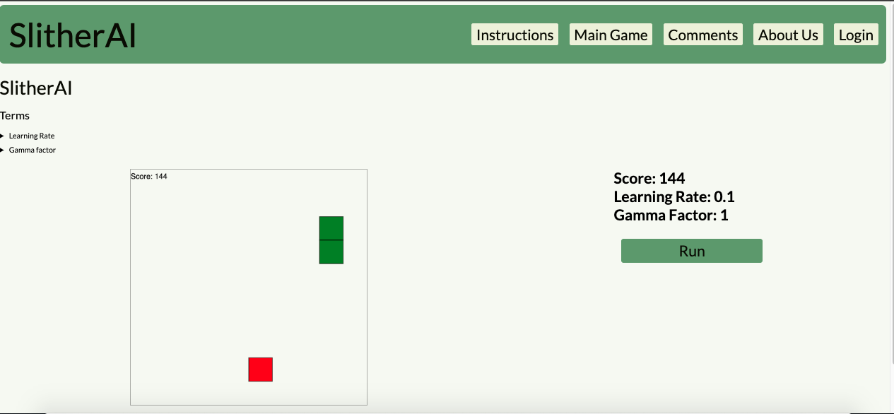

# SlitherAI

## Description

This is a single page MERN application. It illustrates an example of a Deep Q Network (DQN) Reinforced Learning. It automates the snake game, by implementing qTables to enable Reinforced Learning.
Project Power Point Presentation

[Power Point Presentation](./assets/Presentation.pptx)

## Table of Contents

- [Installation](#installation)
- [Usage](#usage)
- [ScreenShot](#screenshot)
- [License](#license)
- [Contributing](#contributing)
- [Tests](#tests)
- [Questions](#questions)

## Installation

N/A

## Usage

It is meant to be viewed online. Interact with the Run button in tbe Main Game tab.

## ScreenShot

## License

This project is covered under the following: MIT License

## Contributing

Submit a GitHub Issue.

## Tests

N/A

## Questions

Direct all questions to: rafael.barbosa51@gmail.com

Github User Name: rbarbosa51

Github Profile URL: https://github.com/rbarbosa51

